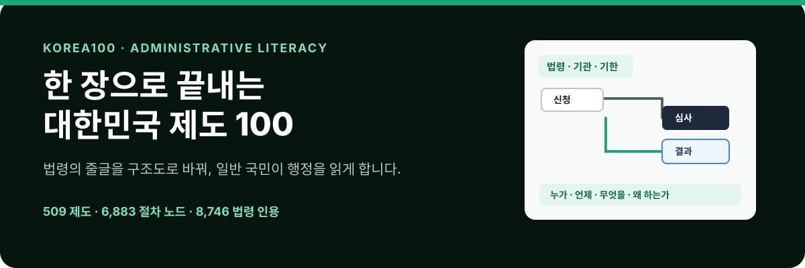

  

  <strong>한국어</strong>
  &nbsp;·&nbsp;
  <a href="README.en.md">English</a>

  <a href="https://hosungseo.github.io/korea100/"><strong>서비스 열기</strong></a>
  &nbsp;·&nbsp;
  <a href="https://hosungseo.github.io/korea100/verification/"><strong>검증 대장</strong></a>
  &nbsp;·&nbsp;
  <a href="#데이터를-읽는-원칙"><strong>검증 원칙</strong></a>
  &nbsp;·&nbsp;
  <a href="docs/development.md"><strong>개발 문서</strong></a>

> **대한민국의 주요 제도를 법령·기관·문서·기한·병목으로 분해해, 한 장의 요약과 업무구조도로 읽게 하는 공개 웹서비스입니다.**
>
> 기업에 비즈니스 모델이 있듯, 국가에는 제도 모델이 있습니다. Korea100은 그 모델을 일반 국민이 따라 읽을 수 있는 행정 리터러시의 형태로 만듭니다.

## 제도를 이렇게 읽습니다

| 법령의 줄글 | Korea100의 구조 | 이해할 수 있는 질문 |
| --- | --- | --- |
| 조문·기관·기한이 흩어진 원문 | **한 장 요약**: 목적, 권한, 돈·문서 흐름, 병목 | 이 제도는 왜 있고, 내게 무엇이 필요한가? |
| 신청·심사·통지·이의신청의 절차 | **업무구조도**: 행위주체 레인, 단계, 근거 조문, 회귀 경로 | 누가 언제 무엇을 결정하며, 막히면 어디로 돌아가는가? |
| 법령만으로 확인할 수 없는 운영 정보 | **검증 대장**: 근거와 확인 필요 사유를 공개 | 무엇이 확인됐고, 무엇을 더 확인해야 하는가? |

**법령을 요약하는 데서 끝나지 않습니다. 줄글을 구조도로 바꿔, 행정이 실제로 작동하는 경로를 보이게 합니다.**

## 지금 읽을 수 있는 것

| 509 | 6,883 | 8,746 | 1,924 |
| :---: | :---: | :---: | :---: |
| 제도 | 절차 노드 | 법령 인용 | 현장 확인 필요 항목 |

- **제도 찾기** — 법령·기관·문서·병목 키워드로 509개 제도를 찾고, 최대 3개를 같은 기준으로 비교합니다.
- **제도 한 장 요약** — 목적, 이해관계자, 법적 근거, 기관 권한, 돈·문서 흐름, 병목과 개선점을 한 화면에서 읽습니다.
- **업무구조도** — 국민, 심사기관, 정보시스템 등 행위주체가 어떤 순서로 일하는지와 신청·반려·이의신청의 되돌아가는 경로를 함께 봅니다.
- **검증 대장** — 법령만으로 확정할 수 없는 정보는 감추거나 추정하지 않고, [확인 필요 사유](https://hosungseo.github.io/korea100/verification/)와 함께 공개합니다.

## 데이터는 어떻게 믿을 수 있나요

정확성은 이 프로젝트의 핵심 가치입니다. 절차 노드에 붙은 법령·행정규칙·조약 인용은 다음 원칙으로 관리합니다.

1. **원문 대조** — 국가법령정보센터의 현행 원문으로 조문 번호뿐 아니라 실제 행위·주체·기한의 근거인지 확인합니다.
2. **다층 검증** — 구조·인용 형식·도달 가능성의 기계 검사, 조문 의미 대조, 독립 절차 재구성, 당사자 관점 워크스루를 거칩니다.
3. **지어내지 않기** — 공개 API에서 확인하지 못한 훈령·고시·내부 규정은 조문 번호를 추정하지 않고 `unverified`로 표시합니다.
4. **정정 이력 공개** — 발견·수정한 오류는 각 제도 데이터의 `warnings`에 날짜와 근거를 남깁니다.

## 데이터와 기술을 더 쓰고 싶다면

Korea100은 읽는 웹서비스이면서, 제도 데이터를 다른 도구와 작업 흐름에 연결하기 위한 기반이기도 합니다.

- [개발 환경·데이터 계약·검증 스크립트](docs/development.md)
- [행정절차 MCP v0.2](mcp/README.md) — R2 검증 절차 질의와 다음 행동 패킷 생성
- [Chrome 사이드패널](chrome-extension/README.md) — 제도를 개인 초안으로 복제해 단계·연결·근거 편집
- [해외 비교법 파일럿: 일본 환경영향평가](docs/comparative-law-pilot/japan-environmental-impact-assessment.md)
- [해외 비교법 파일럿: 베트남 상업 수입통관](docs/comparative-law-pilot/vietnam-commercial-import-customs.md)

## 함께 채워갈 제도

보고 싶은 제도가 없다면 [제작 요청 페이지](https://hosungseo.github.io/korea100/request/)에서 요청할 수 있습니다. 입력값은 서버에 저장하지 않으며, 사용자의 메일 앱 초안으로만 전달됩니다.

## 알아두실 점

- 구조도의 “진행 중” 등 상태는 실시간 행정 데이터가 아니라 제도 흐름을 설명하기 위한 편집 상태입니다.
- 법령 기준일은 제도마다 `asOfDate`로 표시됩니다. 법령은 개정되므로 중요한 판단 전에는 원문을 다시 확인하세요.
- 이 콘텐츠는 제도 이해를 위한 참고 자료이며 법률 자문 또는 정부기관의 공식 해석을 대신하지 않습니다.

## 라이선스

이 저장소의 소프트웨어는 [MIT License](LICENSE)로 공개합니다.
