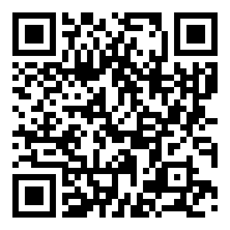

# 조달제도 100 사용설명서

> 복잡한 공공조달·계약 제도를 제도마다 "한 장"으로 정리한 사이트입니다.
> 조달업체, 수요기관, 계약담당공무원 누구든 자기 일에 필요한 제도를 5분 안에 파악하는 것이 목표입니다.

## 지금 접속하기

휴대폰 카메라로 QR을 비추거나 주소로 접속하세요.

**https://milkbuttercheese2.github.io/procurement-system-100/**

---

## 1. 무엇이 들어있나요

조달 업무 흐름 순서(등록·자격 → 발주 → 공고 → 입찰 → 심사 → 계약 → 이행·대금 → 분쟁 → 제재)로 정리된 **제도 59개**가 있습니다. 조달업체 등록부터 수의계약, 적격심사, 물가변동 계약금액 조정, 부정당업자 제재까지 — 실무에서 가장 자주 마주치는 제도들입니다.

각 제도 페이지는 두 부분으로 구성됩니다.

- **업무구조도** — 누가(행위자), 어떤 관문(게이트)을 지나, 어떤 순서로 일이 흘러가는지 그린 지도
- **한 장 캔버스** — 절차 요약, 법적 근거, 적용 대상, 담당자별 제출서류, 유의사항, 관련 제도

## 2. 업무구조도 읽는 법

세로줄은 **게이트**(단계의 관문), 가로줄은 **행위자**(각 중앙관서의 장, 계약담당공무원, 조달업체, 나라장터 등)입니다. 카드 하나가 절차 한 걸음이고, 카드를 누르면 기한·확신도·법적 근거가 열립니다.

| 화살표 | 의미 |
|---|---|
| 실선 (짙은 회록색) | 순차 진행 — 이 일이 끝나면 다음으로 |
| 점선 (초록) | 행위자 사이의 전달 — 통지·제출·송달 |
| 긴 점선 (파랑) | 회귀 — 유찰·보완 등으로 앞 단계로 되돌아감 |

> 📱 모바일에서는 위쪽에 행위자 이름이 **틀고정**되어 아래로 스크롤해도 어느 열이 누구 일인지 보이고, 페이지 상단의 **섹션 점프 바**로 업무구조도·캔버스·유의사항·현장 검증에 바로 이동할 수 있습니다.

## 3. "조문 확인" — 이 사이트의 심장

절차 카드나 법적 근거 옆의 **✓ 조문 확인** 배지를 누르면 팝업이 열립니다.

- **조문 원문** — 국가법령정보센터 공식 원문의 사본을 보여줍니다. 인용이 "제76조제3항"처럼 특정 항을 가리키면 **그 항만** 보여줘서, 무관한 내용에 헷갈릴 일이 없습니다.
- **시행일과 확인일** — 이 원문이 언제 시행된 버전이고 언제 대조했는지 명시합니다.
- **근거법령 바로가기** — 누르면 국가법령정보센터의 **해당 조문 위치로 바로** 이동합니다. 사이트를 믿지 말고 원문으로 직접 확인하세요 — 그러라고 만든 버튼입니다.

## 4. 믿어도 되나요 — 뒤에서 돌아가는 기술

AI가 만든 법령 콘텐츠의 최대 위험은 "그럴듯한 거짓"입니다. 이 사이트는 그걸 막으려고 두 겹의 장치를 둡니다.

### 들어올 때 검사 (작성 시점)

모든 조문은 작성자의 기억이 아니라 **법제처 공식 API에서 받은 원문**에서 출발합니다. 인용한 조문이 실제로 존재하는지, 내용이 원문과 일치하는지 기계로 교차검증합니다.

### 보관 중 상시 검사 (배포 시점)

저장된 인용 **1,400여 건 전부**를 자동화 시스템(CI)이 반복 대조합니다. 법이 개정되면 감지하고, 검사에 실패하면 배포가 멈춥니다. 사람이 지켜보지 않아도 돌아갑니다.

### 관계는 추론하지 않고 조회합니다

"이 조문을 쓰는 제도 전부" 같은 질문은 매번 AI가 다시 판단하는 게 아니라, 미리 계산해 둔 **법령 그래프 인덱스**(제도↔조문·조문↔조문 관계 2,400여 건 + 법제처 공식 위임관계 385건)에서 찾아옵니다. 조회는 환각하지 않습니다.

> ⚠️ 그래서 화면에는 "검증 완료"가 아니라 **"자동대조 완료"** 라고 씁니다 — 기계가 원문과 대조했다는 뜻이지, 사람이 심사했다는 뜻이 아닙니다. 해석·적용의 타당성은 반드시 원문과 전문가로 확인하세요.

## 5. 이런 순서로 써보세요

- **처음 온 업체** — 제도 대장에서 "조달업체 등록" → 업무구조도로 전체 흐름 파악 → 제출서류 확인
- **계약 중 문제가 생겼을 때** — 해당 제도(지체상금, 물가변동 조정, 해제·해지…)의 유의사항과 회귀(파란 점선) 경로 확인
- **근거가 필요할 때** — 조문 확인 팝업 → 근거법령 바로가기로 원문 확보
- **비슷한 제도 비교** — "비교 선반에 담기"로 여러 제도를 같은 기준으로 나란히

---

이 콘텐츠는 제도 이해를 위한 참고자료이며 법률 자문이나 정부기관의 공식 해석을 대신하지 않습니다.
오류 제보: wooseongkyun@korea.kr · 기준일과 버전은 사이트 푸터에 표시됩니다.
